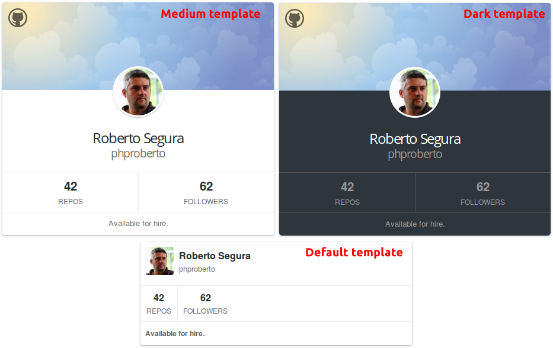

Github card module for Joomla!
=====================

Display your Github profile information in your Joomla website.

This module was developed as playground to teach Joomla development in [joomgouts.com](http://www.joomgouts.com/programas/3x12-introduccion-a-la-programacion-para-joomla-primeros-pasos). 

It tries to explain:

* Usage of `JLayout` to render modules.
* Usage powerful layout calls inside other layouts for template inheritance.
* Usage of the `JGithub` Joomla core API (it's too basic for now but I'll update it probably to use the joomla framework package).
* Replacement of typical module helpers with a module instance that extends a sample reusable base class.
* Cache Github requests inside a table to show how tables work.
* SQL for install, uninstall and updates.
* Usage of extension update servers.
* Usage of media folder.
* Usage of languages.
* 100% overridable layouts.
* 100% overridable assets.

Additionally it makes use of a Gulp build system for:

* Sync files with a test site.
* Compile and minimize styles from Sass.
* Compile and minimize javascript files.
* Release zip file.

## 1. Requirements

* Joomla CMS 3.x website (this is **NOT COMPATIBLE with Joomla CMS 2.5.x**). Joomla CMS 2.5.x is deprecated and you shouldn't learn how to code for it in 2015 :-P

## 1. Installation

You can install this module from the zip 

### 1.1. From ZIP
1. Download [latest zip version](https://github.com/phproberto/mod_phproberto_ghcard/zipball/master)
2. Install from `Extensions` > `Extension Manager` > `Upload Package file`

### 1.2. From cloned folder
1. Clone this repo in your computer with: `git clone git@github.com:phproberto/mod_phproberto_ghcard.git`
2. Install from `Extensions` > `Extension Manager` > `Install from directory`

## 2. License

This module is distributed under the GPL v2. [See LICENSE](LICENSE)  

Copyright (C) 2015 Roberto Segura López. All rights reserved.

